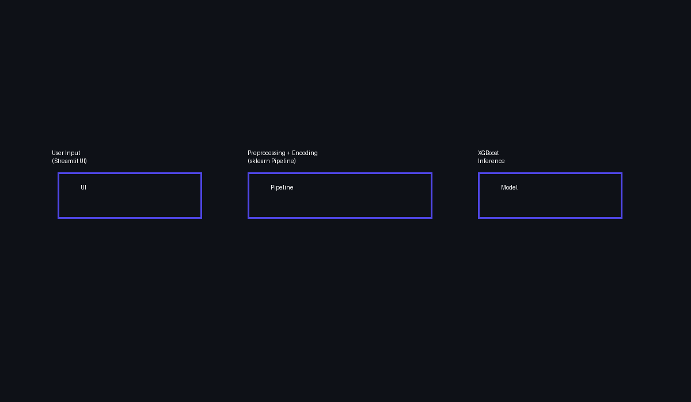

# Credit Risk Assessment System

An explainable, end-to-end machine learning system for assessing loan default risk, built using XGBoost and deployed with Streamlit.

## 🔍 Problem Statement
Financial institutions must assess loan default risk while ensuring transparency, fairness, and regulatory awareness.

## 🧠 Solution Overview
- Unified ML pipeline (preprocessing + model)
- Explainable predictions (SHAP-lite)
- Business-friendly risk score
- Streamlit decision-support UI

## 📊 Dataset
Source: Kaggle Credit Risk Dataset  
https://www.kaggle.com/datasets/laotse/credit-risk-dataset

## 🏗️ Architecture

## 🚀 Live Demo
🔗 Streamlit App: (add link after deployment)

## 🧪 Model Performance
- ROC-AUC: ~0.84
- Interpretable feature contributions
- Balanced performance on imbalanced data

## ⚠️ Disclaimer
This project is for educational and portfolio demonstration purposes only.

## 👤 Author
**Aditya Negi**  
- LinkedIn: https://www.linkedin.com/in/Adityanegi748  
- GitHub: https://github.com/adityanegiuk99
